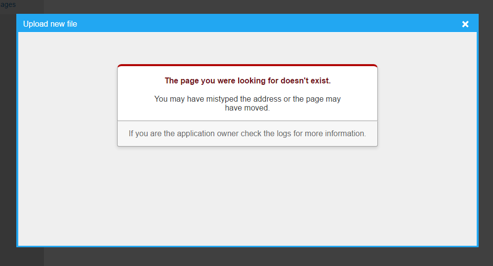

## Overview

A file upload initiated in an application written in Ruby, Node, or Python launched through [Passenger](/docs/cgi-passenger/passenger-supported-apps/) will fail to upload. Thus far, the confirmed failure occurs in [RefineryCMS](http://www.refinerycms.com/) with a generic undefined route message following upload.

\[caption id="attachment\_1285" align="aligncenter" width="998"\] Example conflict in RefineryCMS. Following upload, RefineryCMS reports the route as undefined.\[/caption\]

## Cause

It is a conflict between [upload screening](/docs/web-content/uploads-are-denied-with-406-not-acceptable/) and Passenger, but the underlying cause is not clearly understood. Upload screening was added to enhance server security effective April 6, 2016.

## Solution

Open a ticket in the [control panel](/docs/control-panel/logging-into-the-control-panel/) to request disabling upload screening on files. Once disabled, file uploads will post without interruption.
