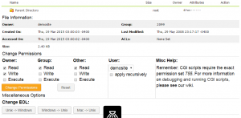
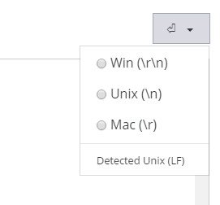

## Overview

End-of-line ("EOL") markers indicate a discontinuation of a current line and beginning of a new line. EOL markers are akin to the return ("⏎") key on a typewriter and, depending upon operating system, are interpreted as a single or combination of characters.

### On Windows

On Windows operating systems, an EOL is marked by two characters: carriage return ("\\r") _and_ newline ("\\n").

### On Linux

On Linux and Unix operating systems, an EOL is marked by one character: a newline ("\\n")

### On Mac

On Mac operating systems, an EOL is marked by one character: a carriage return ("\\r")

### Importance

EOLs are an idiosyncrasy of each operating system. Most cross-platform languages, like PHP, Python, and Ruby will recognize \\r\\n, \\r\\, and \\n as newline markers. Shell scripts, in particular, the first line (called a [shebang](http://en.wikipedia.org/wiki/Shebang_%28Unix%29)) are picky as well as [htaccess]({{ $page->baseUrl }}/guides/htaccess-guide/ ".htaccess Guide") directives as to what EOL is used. For all purposes, always use Linux-style EOL markers (\\n) for EOL. Shell scripts fail to function if any EOL besides \\n are used. htaccess directives fail to work if Mac EOL markers (\\r) are used. [Maildrop]({{ $page->baseUrl }}/guides/mail-filtering/ "Mail filtering") recipes fail to work if any EOL besides \\n are used up to [v6 platforms]({{ $page->baseUrl }}/platform/determining-platform-version/ "Determining platform version"), at which point only Mac EOL markers (\\r) are rejected.

EOLs are the computing equivalent to [The Butter Battle Book](http://en.wikipedia.org/wiki/The_Butter_Battle_Book). There is no prevailing benefit apart from idiosyncrasies baked into the operating system the moment it was conceived. Butter-side up or butter-side down, it conveys the same meaning.

## Converting EOLs

Since different applications mandate different EOLs conversions are unavoidable. An EOL may be easily converted within the [control panel]({{ $page->baseUrl }}/control-panel/logging-into-the-control-panel/ "Logging into the control panel") via **Files** > **File Manager**.

1. Browse to the directory that contains the file
2. Hover to the row that contains the file
3. Select **Properties** under the _Actions_ column
    - This will bring up the file properties dialog to change permissions and EOL conversion filters
        
        \[caption id="attachment\_916" align="aligncenter" width="300"\] File properties dialog\[/caption\]
4. Depending upon the system on which the file was created, click **Windows** > **Unix** or **Mac** > **Unix**

This will convert EOL markers from \\r\\n -> \\n or \\r -> \\n respectively and make it compatible with our hosting platform based off Linux, which itself is a Unix derivative...

### Implicit EOLs

Any shell script that begins with a shebang (`#!`) will automatically have its EOL forced to Unix-style (\\n).

### Saving a file edit with EOL

Files edited within the File Manager may also have a EOL forced upon successful edit. Expand the EOL dropdown above the file contents, then choose the appropriate EOL marker.

\[caption id="attachment\_1262" align="aligncenter" width="271"\] EOL selector in Files > File Manager > Edit File\[/caption\]
