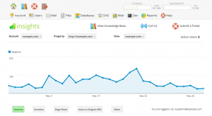
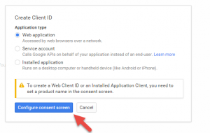
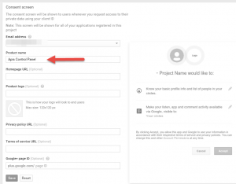
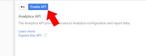

## Overview

Hosting platforms [v5+]({{ $page->baseUrl }}/platform/determining-platform-version/) support easy integration of Google Analytics into your Dashboard. Analytics provide a bevvy of useful metrics including unique visitor count, visitor behavior, SEO efficacy, goal targeting, and browser usage.

\[caption id="attachment\_1022" align="aligncenter" width="300"\] Sample Dashboard with integrated Analytics\[/caption\]

## Enabling Analytics

Analytics requires setup within [Google Code](https://code.google.com/apis/console) and the [control panel]({{ $page->baseUrl }}/control-panel/logging-into-the-control-panel/).

**Prerequisite:** Google Analytics must be setup before completing this. See KB: [Enabling Google Analytics support]({{ $page->baseUrl }}/web-content/enabling-google-analytics-support/).

### Configuring within Google Code

1. Login to [Google Code API Console](https://code.google.com/apis/console) using your Google account.
2. Go to **APIs & Auth** > **Credentials** to create a new OAuth Client ID.
3. Click on **Create new Client ID** to generate a new API ID. This will be used in the control panel to access Analytics.
    - **OPTIONAL:** If you have not previously created a product, you'll be prompted to create one on the consent screen
    - Click to edit the consent screen, and enter a project name such as _Apis Control Panel_, then click **Save** to create this project
4. Select **Application type** > **Web application**
5. Under **Authorized JavaScript origins**, enter the suggested origin under **Account** > **Settings**. If no API key has been submitted yet, this value will appear. If an API key is present, _delete_ it to view the suggested origin.
    
    \[caption id="attachment\_1023" align="aligncenter" width="300"\] Suggested authorized origin in Account > Settings\[/caption\]
    - Use the secure variant, https://, unless you are connecting to the panel over http://
6. Click **Create ID**
    - This is a sample input generated from cp.sol.apiscp.com, your Authorized JavaScript origins and Authorized redirect URIs will differ if on a different server.
        
        \[caption id="attachment\_1024" align="aligncenter" width="295"\] Configured Client ID dialog generated for an account on the server named "Sol"\[/caption\]
7. Copy the **Client ID** value generated. This will be used later under Configuring within the control panel.
    
    \[caption id="attachment\_1025" align="aligncenter" width="300"\] Sample client ID generated within Google's API console. Client ID masked for security.\[/caption\]
8. Authorize control panel access to the Analytics API via **APIs & Auth** > **APIs**. Under **API Library**, search for "_Analytics API_".
    - Select Analytics API.
9. Click on **Enable API** if it is not enabled on your account.
    
    \[caption id="attachment\_1026" align="aligncenter" width="300"\] Enable API button to enable Analytics data sharing within the control panel.\[/caption\]

### Configuring within the control panel

1. Visit **Account** > **Settings**. Under Control Panel enter the **Client ID** generated in the above section into **Google Analytics API Key**.
2. Click **Save Changes**
3. Visit **Web** > **.htaccess Manager** (note: this can also be done via the [htaccess]({{ $page->baseUrl }}/guides/htaccess-guide/) directive ModPagespeedAnalyticsID)
4. Click the Edit action to edit the domain or subdomain to add integration.
5. Click **Add Directive** to expand the directive dialog.
6. Under **Personality** select `Pagespeed`
    1. Configure PageSpeed to use your Analytics ID:
        1. For **Directive**, select `ModPagespeedAnalyticsID`
        2. For **Value** enter your Analytics ID created in KB: [Enabling Google Analytics support]({{ $page->baseUrl }}/web-content/enabling-google-analytics-support/)
        3. Click **Add**
            
            \[caption id="attachment\_1030" align="aligncenter" width="300"\] Sample input configuring your Analytics ID.\[/caption\]
    2. Configure PageSpeed to inject reporting JavaScript into your web pages:
        1. Enable inline Analytics injection now by changing **Directive** from `ModPageSpeedAnalyticsID` to `ModPageSpeedEnableFilters`
        2. Change **Value** from your Analytics ID previously entered to `insert_ga`
        3. Click **Add**
    3. **Save Changes** to save your new .htaccess file
7. Go back to **Account** > **Dashboard**. Click _Access Google Analytics_ button to authenticate.
    
    \[caption id="attachment\_1028" align="aligncenter" width="300"\] Access Google Analytics button to sign-on and begin sharing data with the control panel.\[/caption\]
    - **Important:** if you receive an "_Error: origin\_mismatch_" message, then you have incorrectly entered the **Authorized JavaScript origins**. Return to the previous section to correct. Origin changes may take up to 15 minutes to propagate.
8. Refresh the page. Statistics will load.
    - If statistics fail to load, ensure Analytics API has been enabled (see previous section).

## Disabling Analytics

Visit **Account** > **Settings** > Control Panel section > **Google Analytics API Key** > **Delete** to remove API key access. This will also disable integrated Analytics.

## Limitations

Analytics only works on well-formed HTML pages. Raw files are never reflected in byte usage. For example, linking to a file directly, such as the [100 MB test file](http://d.goap.is/100mb.zip), is never reflected in usage (_click as much as you'd like! it is not reflected in Google Analytics usage_). However, loading an image, such as the logo or control panel sample image on apiscp.com, inline as part of a web page is reflected. This discrepancy occurs because Analytics must include itself in valid HTML. Sending a raw file precludes bootstrapping by lack of a HTML document.
