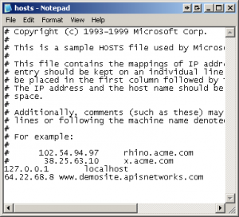

## Overview

Often times when switching hosting companies we would like to see what your domain name looks like before finalizing DNS changes by [changing nameservers](/docs/dns/nameserver-settings/ "Nameserver Settings"). Overriding DNS is done through a [HOSTS](http://en.wikipedia.org/wiki/Hosts_file) file. Any entry in a HOSTS file overrides any other DNS setting that is resolved by a nameserver.

## Making Adjustments

A HOSTS file location depends upon the operating system. All HOSTS files retain the same syntax:

`<IP ADDRESS> <HOSTNAME>`

For example, the following line will force _apiscp.com_ to resolve to _64.22.68.1_:

`64.22.68.1 apiscp.com`

Visit http://apiscp.com to access apiscp.com on the server with an IP address 64.22.68.1. Your server IP address can be found within the control panel under **Account** > **Summary** > **General Information** > **IP Address**.

### Microsoft Windows Vista, Windows 7+

Click on Start menu. Browse to **All Programs** > **Accessories**. Right-click on Notepad and select **Run As Administrator**. If a UAC prompt appears, allow the application to be run as administrator. Go to **File **\> **Open**. Enter `%SystemRoot%\system32\drivers\etc\hosts`. \[caption id="attachment\_93" align="alignnone" width="300"\] Sample hosts file from Windows\[/caption\]

DNS will be updated once the file has been saved and Notepad closed.

### Mac OS X

Open up a terminal session, then enter `sudo nano /private/etc/hosts`. Once changes are done, CTRL + O to save, then CTRL + X to exit. To flush DNS cache, once exited from the text editor, issue `sudo dscacheutil -flushcache` in the terminal.

### Linux

Similarly to Mac OS X, open up a terminal session, and enter  `sudo nano /etc/hosts`. Make changes to the host file, then CTRL + O to save, then CTRL + X to exit. DNS will update automatically.

 

## See Also

- Mac OS X Knowledge Base: [How to add hosts to local hosts file](http://support.apple.com/kb/TA27291?viewlocale=en_US&locale=en_US)
- Linux man pages: [hosts(5)](http://apiscp.com/linux-man/man5/host.conf.5.html)
