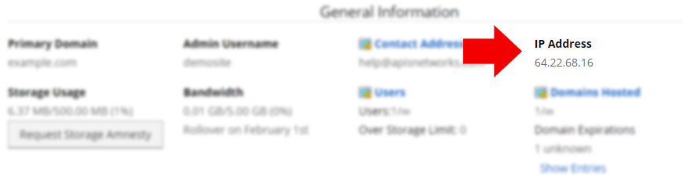

Your IP address, which is the location of your account, may be found within the [control panel]({{ $page->baseUrl }}/control-panel/logging-into-the-control-panel/) under **Account** > **Summary** > General >  IP Address.

