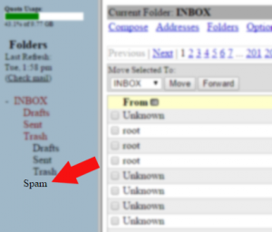

## Overview

Your "Spam" folder is an e-mail folder on all e-mail accounts that quarantines e-mails that have an above-average probability of being spam, but are not clearly spam. In [SpamAssassin]({{ $page->baseUrl }}/e-mail/improving-mail-filter-performance/ "Improving mail filter performance") scoring terms, these are messages that score between 5 and 10.

## Accessing the Spam folder

There are 2 ways to access your Spam folder: from a desktop mail client via IMAP or webmail. If [accessing from your desktop]({{ $page->baseUrl }}/e-mail/accessing-e-mail/ "Accessing e-mail"), mail is located within your Spam folder. If you have just one folder, then you are using POP3 to access e-mail; use the following method:

Access [webmail]({{ $page->baseUrl }}/e-mail/accessing-e-mail/ "Accessing e-mail") within the [control panel]({{ $page->baseUrl }}/control-panel/logging-into-the-control-panel/ "Logging into the control panel"). Select _SquirrelMail_ to login to webmail using SquirrelMail. On the left-hand side, select the **Spam** folder. All messages scored between a 5 and 10 will be located here.

**IMPORTANT:** Messages older than 30 days are automatically cleaned out from this folder.

 

\[caption id="attachment\_299" align="alignnone" width="300"\] Spam folder location in SquirrelMail\[/caption\]
