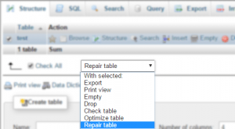

## Overview

MySQL, despite its ease of use and popularity has a dark side of instability and crashes. Communities have forked MySQL, now an [Oracle subsidiary](http://techcrunch.com/2012/08/18/oracle-makes-more-moves-to-kill-open-source-mysql/) (that was once a Sun subsidiary...), spawning alternatives like [Percona](http://www.percona.com), [Drizzle](http://www.drizzle.org/), and [MariaDB](https://mariadb.org/) to improve quality and keep MySQL a viable database server. Newer servers ([platform version 4.5+]({{ $page->baseUrl }}/platform/determining-platform-version/ "Determining platform version")) use alternatives like Percona and MariaDB. Stability is much improved over MySQL, but crashes may still occur.

## Cause

There are a variety of causes ranging from [known bugs](https://bugs.mysql.com/), unknown bugs, exceeding your storage limits, and tidal effects of the moon. Errors are presented in either the [application itself]({{ $page->baseUrl }}/php/changing-php-settings/ "Changing PHP settings") or [error logs]({{ $page->baseUrl }}/web-content/accessing-page-views-and-error-messages/ "Accessing web page views and error messages") of the form,

Table './mydb/some\_table' is marked as crashed and should be repaired

## Solution

Tables may be repaired using phpMyAdmin within the [control panel]({{ $page->baseUrl }}/control-panel/logging-into-the-control-panel/ "Logging into the control panel") under **Databases > phpMyAdmin**.

1. Select your _Database_ under the left pane
2. Select the _Table _marked as crashed
    - Don't know which table? Select all. It will take significantly longer to complete
3. At the bottom of the table row, under _With Selected:_ drop-down menu, select **Repair Table**
4. Operation will complete shortly. Do not close browser until confirmation.
    - Make sure you have sufficient storage available in your account otherwise the operation will not complete.
5. Site will resume operation

\[caption id="attachment\_242" align="alignnone" width="300"\] Repair Table option selected in phpMyAdmin\[/caption\]
