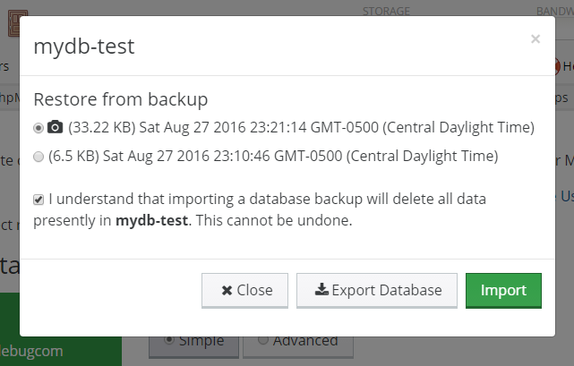

apnscp supports simple MySQL database snapshots as of August 28, 2016. Snapshots are ideal for preserving your database structure before a software update or any situation in which there is risk of loss of data not covered by the nightly backups. Snapshots perform a full database export and stores this file, uncompressed, in your backup directory. Snapshots are automatically removed after 5 days. Snapshots that have been taken may be used, along with automated backups, for rollbacks within the control panel.

\[caption id="attachment\_1351" align="aligncenter" width="641"\] Database restore interface. Camera icon indicates a snapshot.\[/caption\]

## Using snapshots

Snapshots are created within the [control panel](/docs/control-panel/logging-into-the-control-panel/):

1. Visit **Databases** > **MySQL Manager** > _List Users and Databases_
2. Select the database to snapshot.
3. Select **Snapshot** from the actions available in the dropdown.
4. A snapshot will process, which may take a few minutes depending upon size. Once completed a modal dialog will pop-in confirming success.

Snapshots may be accessed within the control panel for 5 days after which time they are automatically deleted. A better long-term solution is to use **Databases** > **MySQL Backups** within the control panel to configure automatic backups with rollout.

Snapshots are never compressed, located within your [home directory](/docs/platform/home-directory-location/), under `mysql_backups/`, and follow the format _DBNAME_\-_YYYYMMDDHHMMSS_\-snapshot.sql

## Restoring from a snapshot or backup

Restoration from a snapshot (short-term) or backup (long-term) can be done easily within the control panel:

1. Visit **Databases** > **MySQL Manager** > _List Users and Databases_
2. Select the database to restore.
3. Select **Restore from Backup** from the actions available in the dropdown.
4. Choose which backup to restore from.
    - Backups are sorted by most recent first. Snapshots are denoted by a camera icon.
5. Check the box to confirm deletion of your current database.
    - All data in the database will be emptied. All backup tasks and user privileges will be preserved.
6. Select **Import**

### Using non-CP exports as restore points

To use a user-created backup to restore from, such as an older snapshot no longer present in `mysql_backups/` or even a phpMyAdmin export, upload the file to `mysql_backups/` within your [home directory](/docs/platform/home-directory-location/) via [FTP](/docs/ftp/accessing-ftp-server/) or the control panel (**Files** > **File Manager**). The backup must follow a few rules:

- File name must be named _DBNAME_\-20 followed by exactly 6 digits (YYMMDD)
    - Or optionally followed by 1 or more digits and "-snapshot"
- End in one of the supported formats: .sql, .zip, .tar, .gz

Once detected successfully, the backup will appear as an option to restore from.

## See also

- KB: [Creating a database](/docs/mysql/creating-database/)
