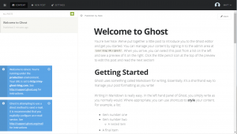

## Overview

Ghost is a gorgeous blogging platform supported on [Developer+ accounts](/docs/terminal/is-terminal-access-available/ "Is terminal access available?") on [v6+](/docs/platform/determining-platform-version/ "Determining platform version") platforms. Ghost requires [terminal access](/docs/terminal/accessing-terminal/ "Accessing terminal") to deploy and hooks into Passenger affording simple process management.

\[caption id="attachment\_750" align="alignnone" width="300"\][](/docs/wp-content/uploads/2015/02/ghost-first-post.png) Basic layout from a fresh Ghost install\[/caption\]

 

## Quickstart

This guide is designed to get Ghost up and running with the fewest steps. Ghost will be SQLite as a database backend, but you might want to [configure it](http://support.ghost.org/config/) to take advantage of MySQL's improved throughput.

1. Login to the [terminal](/docs/terminal/accessing-terminal/ "Accessing terminal")
2. Create a subdomain to serve Ghost. Since it's launched with Passenger, you will need to make a Passenger-compatible filesystem layout
    - cd /var/www
        mkdir -p ghost/{tmp,public}
        cd ghost
        
3. [Download Ghost](https://ghost.org/download/) from ghost.org. At the time of writing, 0.6.4 is the latest version:
    - wget https://ghost.org/zip/ghost-0.6.4.zip
        unzip ghost-0.6.4.zip
        rm -f ghost-0.6.4.zip
        
4. Ghost has been downloaded and extracted to `/var/www/ghost`. Ghost is a Node.js application that relies on third-party dependencies to run. These can be installed used the Node.js package manager (_npm_)
    - Install missing dependencies:
        
        ```
        npm install --production 
        ```
        
5. Connect `public/` to a subdomain within the [control panel](/docs/control-panel/logging-into-the-control-panel/ "Logging into the control panel") under **Web** > ****Subdomains****
    
    \[caption id="attachment\_754" align="alignnone" width="300"\][](/docs/wp-content/uploads/2015/02/ghost-subdomain-assignment.png) Connecting Ghost to a subdomain within the control panel\[/caption\]
6. Create a [.htaccess](/docs/guides/htaccess-guide/ ".htaccess Guide") control file in `public/` and set _PassengerNodejs_ to inform the web server that this is a [Node.js application](/docs/guides/running-node-js/ "Running Node.js") to be launched with Passenger. \```which node` `` is shorthand to resolve the location of your Node interpreter as selected by [nvm](/docs/node/changing-node-versions/):
    - echo "PassengerNodejs \`which node\`" >> public/.htaccess
        
7. Create a [MySQL database](/docs/mysql/creating-database/). Ghost connects over TCP socket, so ensure that [remote permissions](/docs/mysql/connecting-remotely-mysql/) on 127.0.0.1 are granted to the user. By default, when a user is created, permissions are only granted to "localhost" and not 127.0.0.1.
8. Edit `core/server/config/env/config.production.json` with your database credentials. Change _user_, _password_, and _database_ fields.
    - nano core/server/config/env/config.production.json
        
9. Populate the database
    - env NODE\_ENV=production knex-migrator init
        
10. Finally, Passenger expects the entry-point to be named "`app.js`". Ghost uses `index.js` as its startup file. Create a symbolic link from `index.js` to `app.js` to satisfy Passenger:
    - ln -s index.js app.js
        
11. Once done, access /signup on the subdomain to setup your admin account
    - For example, in this walkthrough, the URL on _ghost.example.com_ would be _http://ghost.example.com/ghost_
12. _**Enjoy!**_
    
    \[caption id="attachment\_748" align="alignnone" width="300"\][](/docs/wp-content/uploads/2015/02/ghost-admin-dialog.png) Ghost administrative dialog after setup\[/caption\]

## Odds and Ends

### Restarting

Node.js piggybacks Passenger, and in doing so, can be easily restarted using the `tmp/` control directory. Follow the general [guide to restarting](/docs/ruby/restarting-passenger-processes/ "Restarting Passenger processes") a Passenger-backed application.

## See also

- [Ghost Website](https://ghost.org/)
- [Ghost Configuration](http://support.ghost.org/config/)
- [Ghost Documentation: Getting Started](http://support.ghost.org/getting-started/)
- [Example Ghost installation on a v6 platform](http://ghost.futz.net/)
