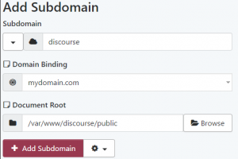
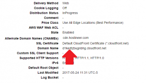

[Discourse](https://www.discourse.org/) is a popular forum software written in Ruby. Because Discourse relies on Docker, which is incompatible with the platform, installation must be carried out manually. A [Pro package](https://apiscp.com/pricing) is recommended to run Discourse as each worker is approximately 200 MB.

## Getting Started

Installation is done within the [Terminal](/docs/terminal/accessing-terminal/).

1. Checkout the Discourse repository from [GitHub](https://github.com/discourse/discourse) into /var/www
    
    cd /var/www
    git clone https://github.com/discourse/discourse.git
    cd discourse
    
2. Verify the Ruby interpreter is at least 2.3.1. [Switch interpreters](/docs/ruby/changing-ruby-versions/) if not.
    
    rvm list
    # Look that at least ruby-2.3.1 is the current interpreter
    rvm use 2.4.1
    
    - Optionally designate the Ruby version as your default Ruby interpreter for the directory:
        
        echo 2.4.1 > .ruby-version
        
3. Install Bundle and application dependencies:
    
    gem install bundle
    bundle install
    
    - **Note:** depending upon platform, the build process will fail on the pg gem. Set the pg build configuration, then rerun `bundle install` to continue installation ([v7](/docs/platform/determining-platform-version/) uses PostgreSQL 9.6, v6.5 9.4, and v6 9.1):
        
        bundle config build.pg --with-pg-config=/usr/pgsql-9.6/bin/pg\_config
        
4. Setup [Redis](/docs/guides/running-redis/)
5. Create a PostgreSQL database (**Databases** > **PostgreSQL Manager**). Be sure to bump the user designated to connect to the database from the system default 5 to _15 concurrent connections_. Discourse pools its connections and requires a higher allowance.
6. Create a new user to relay email for Discourse via **User** > **Add User**. Ensure that the user has email privileges (incoming, outgoing) enabled.
7. Copy `config/discourse_defaults.conf` to `config/discourse.conf`, this will provide application-specific overrides
    
    cp config/discourse\_defaults.conf config/discourse.conf
    
8. Change the following `config/discourse.conf`  values to match what is on your account: db\_pool (set to `5`), developer\_emails, db\_name, db\_host (set to `127.0.0.1`), db\_username, db\_password, hostname, smtp\_address (set to `localhost`), smtp\_user\_name, smtp\_password, smtp\_openssl\_verify\_mode (set to `none`), redis\_port
    - developer\_emails is a comma-delimited list of users that register who are conferred admin rights
9. Populate the database:
    
    RAILS\_ENV=production bundle exec rake db:migrate
    
    - Migration will fail requiring the hstore, pg\_trgm extensions. Open a ticket in the panel to request hstore and pg\_trgm to be added to your PostgreSQL database (also include the database name). Alternatively, use [Beacon](/docs/control-panel/scripting-with-beacon/) to call [sql\_add\_pgsql\_extension](http://docs.apiscp.com/class-Sql_Module.html#_add_pgsql_extension). Both "pg\_trgm" and "hstore" are supported.
10. Precompile assets:
    
    RAILS\_ENV=production bundle exec rake assets:precompile
    
11. Create an upload storage directory under `public/`
    
    mkdir public/uploads
    
12. Dispatch Sidekiq, which handles tasks for Discourse, including sending email
    
    RAILS\_ENV=production rvm 2.4.1 do sidekiq -L /tmp/sidekiq.log -P /tmp/sidekiq.pid -q critical -q low -q default -d
    
13. Populate initial posts
    
    RAILS\_ENV=production bundle exec rake posts:rebake
    
14. Setup Passenger to serve the application:
    
    gem install --no-rdoc --no-ri passenger
    passenger-config --ruby-command
    
    - Add `RailsEnv production` to your [.htaccess](/docs/guides/htaccess-guide/) control under `public/`
    - Add [PassengerRuby](/docs/ruby/setting-rails-passenger/) directive to your [.htaccess](/docs/guides/htaccess-guide/) control under `public/`, e.g. `PassengerRuby /home/apnscp/.rvm/gems/ruby-2.4.0/wrappers/ruby`
15. Lastly, connect `discourse/public` to a [subdomain](/docs/web-content/creating-subdomain/) or addon domain.
    
    \[caption id="attachment\_1471" align="aligncenter" width="300"\] Connecting Discourse to a subdomain named discourse.mydomain.com\[/caption\]
16. Visit your new Discourse forum. Register using your email address specified in `developer_emails`. A confirmation email will be sent if all is configured correct (smtp\* settings) and Sidekiq is running. Click the link and follow the setup instructions!**Note:** adding a CDN in the following section is highly recommended

## Adding CDN

Without a CDN, Discourse will serve all content through its application, which creates significant overhead. Placing a CDN in front of the static assets will allow a third-party to cache and send static content thus speeding up Discourse significantly.

Any CDN will work. Amazon [CloudFront](https://aws.amazon.com/cloudfront/) offers 50 GB free and will be used for this example.

Given Discourse runs on _discourse.mydomain.com_ and the CDN will be called _cdn.mydomain.com_:

- Add a CORS header to `public/.htaccess`:
    
    Header set Access-Control-Allow-Origin "http://discourse.mydomain.com"
    
- In CloudFront, click **Create Distribution**
    - Select **Web**
    - Under **Origin Domain Name**, enter _discourse.mydomain.com_
    - Under **Origin ID**, enter _cdn.mydomain.com_
    - Under **Alternative Domain Names (CNAMEs)**, specify _cdn.mydomain.com_
    - Under **Forward Headers**, select _Whitelist_
        - **Whitelist Headers** is now accessible. Under the header list, select _Origin_. Click **Add >>**.
- Visit **DNS** > **DNS Manager**. Create a new CNAME record for cdn.mydomain.com.
    - Select **CNAME** as RR.
    - Enter the **CloudFront Domain Name** as your parameter.
    - Click **Add**
        
        \[caption id="attachment\_1478" align="aligncenter" width="300"\] CloudFront domain field\[/caption\]
- Edit `config/discourse.conf`. Change **cdn\_url**
- [Restart Discourse](/docs/ruby/restarting-passenger-processes/)
    
    touch tmp/restart.txt
