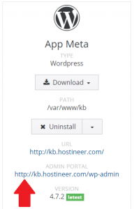

## Overview

WordPress administrative panel, which allows management to your WordPress site, can be accessed within [apnscp](/docs/control-panel/logging-into-the-control-panel/) via Web > Web Apps. Select the domain where WordPress is installed. Click [Detect](/docs/control-panel/detecting-a-web-application/) if necessary. Click on the link under **ADMIN PORTAL**. If you have forgotten your login or password, click on "[Change Admin Password](/docs/wordpress/resetting-wordpress-password/)" in Web Apps.

