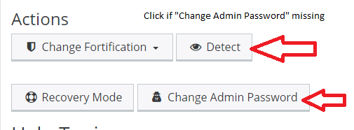
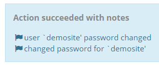

## Overview

On v4.5+ platforms, WordPress may be reset within the [control panel]({{ $page->baseUrl }}/control-panel/logging-into-the-control-panel/).

1. Visit **Web** > **Web Apps**
2. Select the hostname, or if WordPress resides in a folder below the hostname, e.g. example.com/wordpress, then click the dropdown indicator > **Edit Subdir**
3. _If the location is not known to contain WordPress_, click **Detect** first to detect the application as WordPress. If the location is known to contain WordPress, select **Change Admin Password**.
    
    \[caption id="attachment\_1343" align="aligncenter" width="505"\] Resetting a WP password. First select Detect, then Change Admin Password\[/caption\]
4. Enter a new password.
5. Click action button Change Password to confirm changes.
6. Once changed, the admin username will be included in the postback response.
    
    \[caption id="attachment\_1344" align="aligncenter" width="313"\] Success message following a password reset, including the username of the WP install.\[/caption\]
